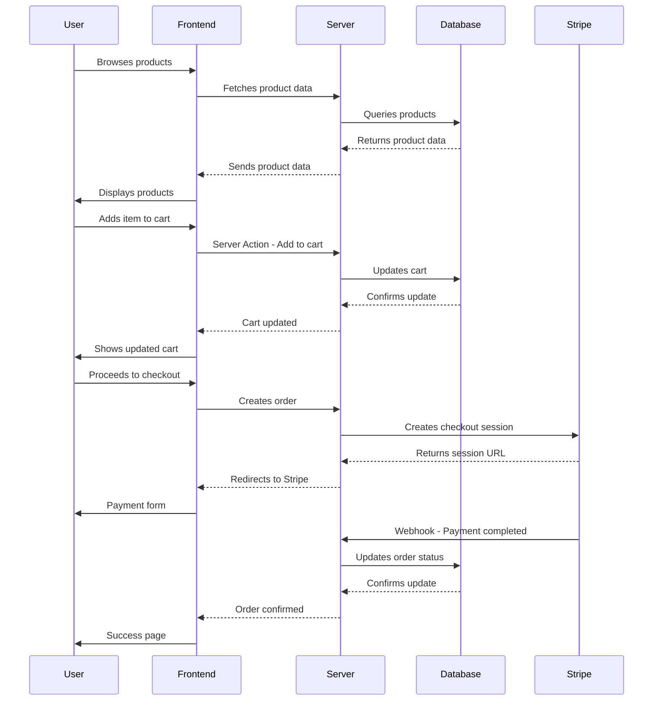

# Bewear

A modern e-commerce platform built with Next.js 15 and TypeScript, featuring secure payment processing with Stripe and real-time cart management.

### Tech Stack

- **Framework:** Next.js 15 (App Router)
- **Language:** TypeScript
- **Navigation:** Next.js App Router
- **State Management:** React Query (TanStack Query)
- **Forms & Validation:** React Hook Form + Zod
- **HTTP Client:** Next.js Server Actions
- **Styling:** Tailwind CSS + shadcn/ui
- **Database:** PostgreSQL with Drizzle ORM
- **Authentication:** BetterAuth
- **Payment Processing:** Stripe
- **Key Libraries/Services:** Lucide React, Sonner, React Number Format

<div align="center" style="display: inline_block justify-center"><br>
   </div>

  ## 🚀 Main Features

- **Browse products** by categories with dynamic filtering and search
- **Shopping cart** with real-time updates and quantity management
- **Secure checkout** powered by Stripe with webhook validation
- **User authentication** with email/password and session management
- **Order tracking** with status updates and complete order history
- **Responsive design** optimized for all devices with Tailwind CSS

## 📊 Core Application Flow




## ⚡ How to Run Locally

1. Clone the repository:

   ```bash
   git clone [repository_url] cd bewear
   ```

2. Install dependencies:

   ```bash
   npm install
   ```

3. Set up environment variables:
   Create a `.env.local` file with:

   ```
   DATABASE_URL=your_postgres_connection_string
   STRIPE_SECRET_KEY=your_stripe_secret_key
   STRIPE_WEBHOOK_SECRET=your_stripe_webhook_secret
   BETTER_AUTH_SECRET=your_auth_secret
   ```

4. Set up the database:

   ```bash
   npm run db:push
   npm run db:seed
   ```

5. Start the development server:

   ```bash
   npm run dev
   ```

6. Open [http://localhost:3000](http://localhost:3000) in your browser.

## 📚 Learn More

For full details on architecture, features, components, and improvement suggestions, please see the [complete documentation](./documentation.md).

---

made with ♥ by [giacomosalsano](https://giacomosalsano.com)!
